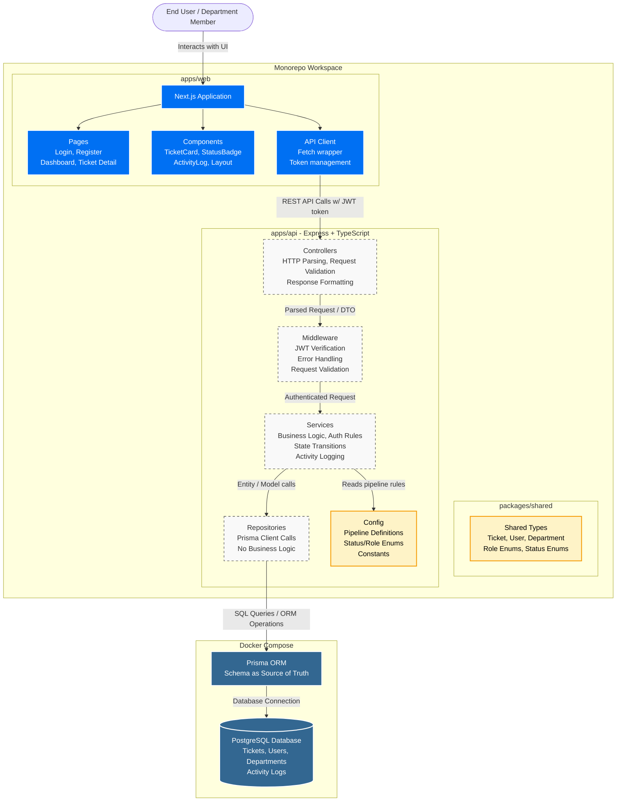

# Architecture: Layered Controller-Service-Repository

## Pattern Name
**CSR Layered Architecture** (Controller → Service → Repository)

## Why This Pattern
- Pragmatic for scoped take-home — avoids Clean Architecture boilerplate
- Industry-standard for TypeScript/Express APIs
- Testable: services can be tested without HTTP layer
- Thin controllers, fat services, anemic repositories
- Easily consumable by future mobile clients (clean REST, no web-specific assumptions)

## Architecture Diagram



## Layers

### 1. Controllers
- Handle HTTP request/response cycle
- Parse request body, params, query strings
- Validate input shape (not business rules)
- Call appropriate service method
- Format and return response
- **Never** contain `if` statements about business logic

### 2. Middleware
- **JWT Middleware:** Verify token, attach user to request
- **Error Middleware:** Catch all errors, return consistent format
- **Validation Middleware:** Validate request shape before controller

### 3. Services
- Business logic lives here
- Authorization rules ("Can this user escalate this ticket?")
- State transitions ("Is this status change valid?")
- Activity logging ("Log this action after it succeeds")
- **This is the most important layer**

### 4. Repositories
- Thin wrappers around Prisma client calls
- No business logic, no authorization checks
- Simply fetch and return data
- Easy to swap ORM if needed (unlikely, but clean)

### 5. Config
- Hardcoded pipeline definitions
- Status and role enums
- Constants (token expiry, etc.)

## Monorepo Structure

```
takehome/
├── package.json              # Root workspace config
├── docker-compose.yml        # PostgreSQL
├── apps/
│   ├── api/                  # Express backend
│   └── web/                  # Next.js frontend
└── packages/
    └── shared/               # Shared TypeScript types
```

## Infrastructure
- Docker Compose → PostgreSQL (local dev only)
- Prisma ORM → schema.prisma as source of truth
- Seed script → departments, users, ticket types, sample tickets
- npm workspaces → dependency management across monorepo
